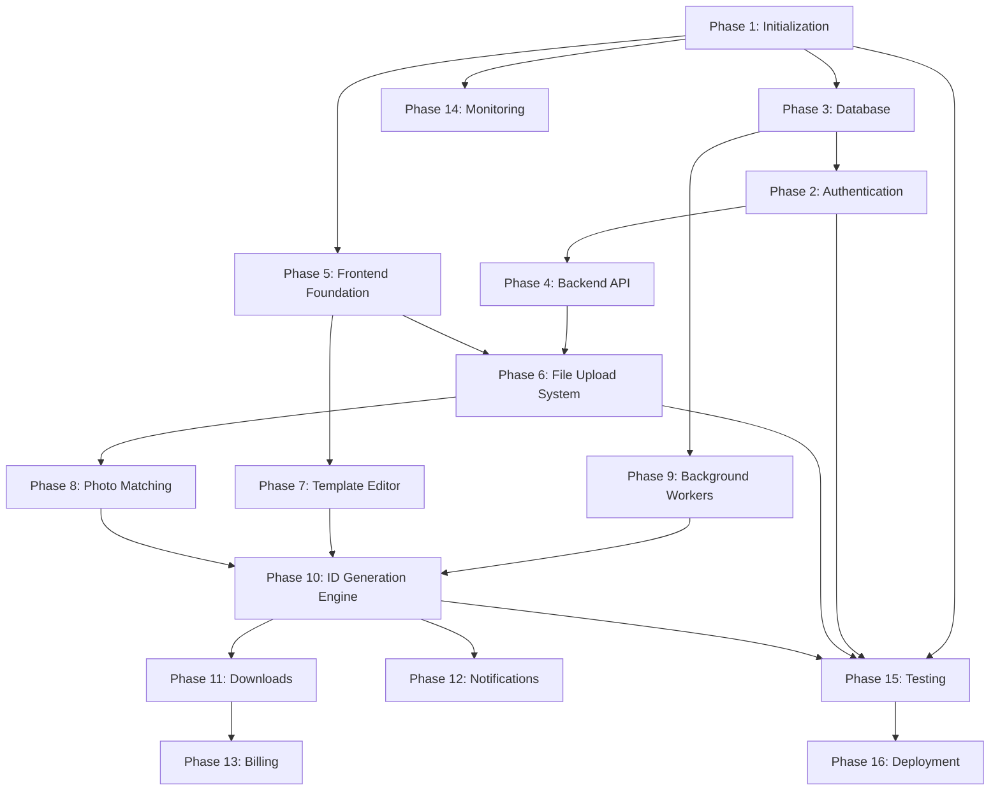

```markdown
# Implementation Roadmap

**Project:** Doc2ID AI  
**Document Version:** 1.0 (Enterprise Specification)  
**Status:** Pending Approval  
**Author:** Principal Software Architect & Technical Program Manager  

---

## 1. DOCUMENT INFORMATION
*   **Title:** Doc2ID AI Implementation Roadmap
*   **Purpose:** Defines the step-by-step engineering execution plan, breaking down the PRD, SAD, TDD, UI/UX, DBS, and API specifications into logical, actionable development phases.
*   **Audience:** Engineering Managers, Backend/Frontend Developers, DevOps, QA.

---

## 2. PROJECT TIMELINE & MILESTONES

### 2.1 MVP Milestones (Weeks 1 - 12)
*   **Milestone 1: Core Foundation (Weeks 1-3)** - Project Init, Database, Auth, Backend API, Frontend Foundation.
*   **Milestone 2: Ingestion & Design (Weeks 4-7)** - File Upload System, Template Editor, Photo Matching.
*   **Milestone 3: Engine & Async Processing (Weeks 8-10)** - Background Workers, ID Generation Engine, Downloads.
*   **Milestone 4: Polish & Launch (Weeks 11-12)** - Notifications, Monitoring, Testing, Deployment.

### 2.2 Post-MVP Roadmap (Weeks 13 - 16)
*   **Billing & Subscription:** Integration with Stripe (Phase 13).
*   **Advanced Image Processing:** AI-powered background removal for headshots.
*   **Custom Domains:** Enterprise tenant branded portals.

### 2.3 Version 2.0 Roadmap (Month 5+)
*   **Data Extraction:** OCR integration for handwritten/scanned paper forms.
*   **Digital Wallets:** Direct provisioning of generated IDs to Apple/Google Wallet.
*   **Public API & Webhooks:** SDKs and developer endpoints for third-party HR system integrations.

---

## 3. DEPENDENCY GRAPH



---

## 4. DEFINITION OF DONE (DoD) CHECKLIST
*Applies to every Phase and Milestone below.*

- [ ] **Code Complete:** Feature implemented exactly as specified in PRD/TDD.
- [ ] **Linting & Formatting:** Zero ESLint or Prettier warnings/errors.
- [ ] **Type Safety:** Zero TypeScript `any` types or strict-mode violations.
- [ ] **Testing:** Unit tests written with >80% coverage; Integration tests passing.
- [ ] **Code Review:** Approved by at least one Senior Engineer via GitHub PR.
- [ ] **QA Passed:** Feature tested against Acceptance Criteria in a Staging environment.
- [ ] **Documentation:** Inline code comments added; API docs updated if endpoints changed.
- [ ] **Security:** No hardcoded secrets; OWASP top 10 vulnerabilities verified mitigated.

---

## 5. DEVELOPMENT PHASES

### Phase 1 — Project Initialization
*   **Goal:** Establish the foundational Git repository, monorepo structure, and CI/CD pipelines.
*   **Deliverables:** GitHub repo, Next.js/Express scaffolding, ESLint/Prettier, Dockerfiles.
*   **Dependencies:** None.
*   **Estimated Complexity:** Low.
*   **Risks:** Misconfigured strict TypeScript rules slowing down early development.
*   **Tasks:**
    1. Scaffold `/frontend` (Next.js) and `/backend` (Node/Express).
    2. Configure `.editorconfig`, `.prettierrc`, and `.eslintrc`.
    3. Setup GitHub Actions for CI (Build, Lint, Test).
    4. Define environment variable `.env.example` templates.
*   **Expected Outputs:** A clean, building, and deployable empty monorepo.
*   **Branch Naming:** `chore/ph1-initialization`
*   **Commit Naming:** `chore(core): setup eslint and prettier`
*   **Acceptance Criteria:** CI pipeline passes green on an empty PR.

### Phase 3 — Database *(Executed before Auth for schema availability)*
*   **Goal:** Provision the PostgreSQL database and define the physical schema.
*   **Deliverables:** Prisma/SQL schema, initial migrations, seed scripts.
*   **Dependencies:** Phase 1.
*   **Estimated Complexity:** Medium.
*   **Risks:** Poorly designed indexes causing massive slowdowns later.
*   **Tasks:**
    1. Define ORM schema based on DBS v2.0.
    2. Create initial migration scripts (`organizations`, `users`, `projects`, etc.).
    3. Implement database connection pool (PgBouncer).
    4. Create seed data script for development (Admin user, Default templates).
*   **Expected Outputs:** Running local PostgreSQL container with fully migrated schema.
*   **Branch Naming:** `feat/ph3-database-schema`
*   **Commit Naming:** `feat(db): implement initial migration for users and orgs`
*   **Acceptance Criteria:** `npm run db:seed` executes successfully and populates test data.

### Phase 2 — Authentication
*   **Goal:** Secure the application and implement tenant isolation.
*   **Deliverables:** JWT auth flow, RBAC middleware, Login/Register UI.
*   **Dependencies:** Phase 3.
*   **Estimated Complexity:** High (Security critical).
*   **Risks:** Token leakage, cross-tenant data exposure.
*   **Tasks:**
    1. Build `POST /auth/register` and `/auth/login` endpoints.
    2. Implement Argon2 password hashing and JWT generation.
    3. Build `requireAuth` and `requireRole` Express middlewares.
    4. Develop Frontend Auth pages (Login, Register).
*   **Expected Outputs:** Secure user login resulting in an active session and scoped DB queries.
*   **Branch Naming:** `feat/ph2-authentication`
*   **Commit Naming:** `feat(auth): implement jwt generation and validation`
*   **Acceptance Criteria:** User can register, login, and access a protected route that returns their specific `organization_id`.

### Phase 4 — Backend API
*   **Goal:** Scaffold the core REST endpoints for basic entities.
*   **Deliverables:** Project CRUD, User Profile CRUD, Organization CRUD.
*   **Dependencies:** Phase 2, Phase 3.
*   **Estimated Complexity:** Low.
*   **Risks:** Inconsistent error response shapes.
*   **Tasks:**
    1. Implement centralized error handling middleware.
    2. Build Controllers, Services, and Repositories for `Projects` and `Organizations`.
    3. Implement input validation using Zod schemas.
*   **Expected Outputs:** Fully functional REST API responding with standard JSON envelopes.
*   **Branch Naming:** `feat/ph4-core-api`
*   **Commit Naming:** `feat(api): implement projects crud endpoints`
*   **Acceptance Criteria:** API passes Postman/Jest suite for creating and retrieving projects.

### Phase 5 — Frontend Foundation
*   **Goal:** Establish the UI design system and global state.
*   **Deliverables:** Tailwind setup, Base UI components, Zustand store, Axios interceptors.
*   **Dependencies:** Phase 1.
*   **Estimated Complexity:** Medium.
*   **Risks:** Component drift if developers don't adhere to the central library.
*   **Tasks:**
    1. Configure Tailwind themes, colors, and typography from UI/UX Spec.
    2. Build reusable atomic components (Buttons, Inputs, Modals, Tables, Toasts).
    3. Setup Zustand global store (Active Org, User Profile).
    4. Implement generic App Shell (Sidebar, Header).
*   **Expected Outputs:** A functional dashboard shell populated with mock data.
*   **Branch Naming:** `feat/ph5-frontend-foundation`
*   **Commit Naming:** `feat(ui): implement base button and modal components`
*   **Acceptance Criteria:** Sidebar navigation works; Storybook/UI library demonstrates all base components.

### Phase 6 — File Upload System
*   **Goal:** Ingest heavy user data via spreadsheets securely.
*   **Deliverables:** S3 Pre-signed URLs, CSV parser, Data Grid UI.
*   **Dependencies:** Phase 4, Phase 5.
*   **Estimated Complexity:** High.
*   **Risks:** Memory crashes on massive CSV files.
*   **Tasks:**
    1. Build S3 bucket provisioning and IAM policies.
    2. Implement `/uploads/presigned-url` endpoint.
    3. Build background CSV/Excel parser that streams data into `import_records`.
    4. Build Frontend Dropzone and Virtualized Data Grid table.
*   **Expected Outputs:** User drops an Excel file, and rows appear in the UI data table.
*   **Branch Naming:** `feat/ph6-file-uploads`
*   **Commit Naming:** `feat(upload): implement s3 presigned url generation`
*   **Acceptance Criteria:** 10,000-row CSV successfully parses and displays without browser lag.

### Phase 7 — Template Editor
*   **Goal:** Provide a drag-and-drop WYSIWYG canvas for ID design.
*   **Deliverables:** Canvas UI, Toolbox, Properties panel, JSON schema saving.
*   **Dependencies:** Phase 5.
*   **Estimated Complexity:** Very High.
*   **Risks:** Canvas coordinates misaligning with backend PDF render coordinates.
*   **Tasks:**
    1. Integrate `react-konva` or `fabric.js`.
    2. Build draggable components (Text, Image, QR Code).
    3. Implement Data Binding dropdowns linking UI elements to CSV columns.
    4. Build `POST /templates/{id}/versions` endpoint to freeze layout JSON.
*   **Expected Outputs:** Interactive editor where a user can design a card and save the layout.
*   **Branch Naming:** `feat/ph7-template-editor`
*   **Commit Naming:** `feat(editor): implement drag and drop text elements`
*   **Acceptance Criteria:** User can place a text box, bind it to `{{First_Name}}`, and save the template successfully.

### Phase 8 — Photo Matching
*   **Goal:** Automatically map bulk uploaded headshots to data rows.
*   **Deliverables:** ZIP extractor worker, String-matching algorithm, Split-pane UI.
*   **Dependencies:** Phase 6.
*   **Estimated Complexity:** High.
*   **Risks:** High CPU usage during ZIP extraction; fuzzy matching inaccuracies.
*   **Tasks:**
    1. Build background worker to extract `.zip` and upload contents to S3.
    2. Implement exact/fuzzy matching algorithm (`original_filename` to Row column).
    3. Build Frontend Split-pane UI for reviewing matches.
    4. Implement manual drag-and-drop override.
*   **Expected Outputs:** ZIP is uploaded, and the UI shows 95%+ photos mapped to the correct name.
*   **Branch Naming:** `feat/ph8-photo-matching`
*   **Commit Naming:** `feat(photos): implement fuzzy matching algorithm`
*   **Acceptance Criteria:** A ZIP with 1,000 photos correctly maps to a 1,000-row dataset in under 1 minute.

### Phase 9 — Background Workers
*   **Goal:** Establish the asynchronous infrastructure for heavy compute.
*   **Deliverables:** Redis cluster, BullMQ setup, Worker Node scaffolding.
*   **Dependencies:** Phase 3.
*   **Estimated Complexity:** High.
*   **Risks:** Orphaned jobs, dead letter queue overflows, memory leaks.
*   **Tasks:**
    1. Deploy ElastiCache/Redis instance.
    2. Implement BullMQ Queues, Workers, and QueueEvents.
    3. Implement job retry policies and failure handling logic.
*   **Expected Outputs:** Robust async queue capable of handling thousands of dummy jobs per second.
*   **Branch Naming:** `chore/ph9-background-workers`
*   **Commit Naming:** `chore(queue): configure bullmq redis connection`
*   **Acceptance Criteria:** 50,000 dummy jobs enqueue and process across 3 worker instances without dropping.

### Phase 10 — ID Generation Engine
*   **Goal:** The core rendering logic mapping data into physical PDFs.
*   **Deliverables:** Puppeteer/PDFKit renderer, Master-to-Micro job orchestrator.
*   **Dependencies:** Phase 7, Phase 8, Phase 9.
*   **Estimated Complexity:** Very High.
*   **Risks:** Headless browser memory exhaustion; font rendering inconsistencies.
*   **Tasks:**
    1. Build the HTML/CSS compiler that converts Template JSON + Row Data into a DOM state.
    2. Implement Puppeteer script to capture the DOM as a high-res PNG/PDF.
    3. Build the Orchestrator: 1 `Generation_Job` splits into `N` `Generation_Job_Items`.
    4. Stream rendered assets back to S3.
*   **Expected Outputs:** The actual creation of ID cards in the cloud.
*   **Branch Naming:** `feat/ph10-generation-engine`
*   **Commit Naming:** `feat(engine): implement puppeteer pdf render script`
*   **Acceptance Criteria:** Worker correctly renders a complex template with photos and QR codes into a visually perfect PDF.

### Phase 11 — Downloads
*   **Goal:** Securely package and deliver the rendered assets to the user.
*   **Deliverables:** Packaging worker, Download Center UI, Audit logs.
*   **Dependencies:** Phase 10.
*   **Estimated Complexity:** Medium.
*   **Risks:** Generating massive multi-gigabyte ZIP files timing out.
*   **Tasks:**
    1. Build "Package Batch" worker to combine 1,000 PDFs into a single ZIP or Imposed PDF.
    2. Build `GET /downloads/{id}/link` for expiring S3 URLs.
    3. Build Frontend Downloads table.
*   **Expected Outputs:** User clicks download and receives the final printable file.
*   **Branch Naming:** `feat/ph11-downloads`
*   **Commit Naming:** `feat(downloads): implement zip packaging worker`
*   **Acceptance Criteria:** A 1,000-card batch packages into a ZIP and is downloaded successfully.

### Phase 12 — Notifications
*   **Goal:** Real-time updates for long-running async tasks.
*   **Deliverables:** WebSockets/SSE, Notification DB table, UI Dropdown.
*   **Dependencies:** Phase 10.
*   **Estimated Complexity:** Medium.
*   **Risks:** WebSocket connection drops causing users to think a job is stuck.
*   **Tasks:**
    1. Implement Socket.io or SSE server in Express.
    2. Broadcast job progress (`processed/total`) from BullMQ to the client.
    3. Build UI Notification dropdown and progress bar overlays.
*   **Expected Outputs:** Progress bar moves in real-time as background workers render cards.
*   **Branch Naming:** `feat/ph12-notifications`
*   **Commit Naming:** `feat(ws): implement generation progress broadcasts`
*   **Acceptance Criteria:** User sees "Batch Complete" toast instantly when the last worker finishes, without refreshing the page.

### Phase 13 — Billing (Post-MVP Target)
*   **Goal:** Monetize the platform.
*   **Deliverables:** Stripe integration, usage tracking, quota enforcement.
*   **Dependencies:** Phase 11.
*   **Estimated Complexity:** High.
*   **Risks:** Accidentally blocking paid users due to race conditions in quota counts.
*   **Tasks:**
    1. Integrate Stripe Checkout and Customer Portal.
    2. Implement Stripe Webhooks to listen for subscription updates.
    3. Enforce API usage limits based on billing tier.

### Phase 14 — Monitoring
*   **Goal:** System observability and debugging.
*   **Deliverables:** Pino logging, Datadog/Sentry integration.
*   **Dependencies:** Phase 1.
*   **Estimated Complexity:** Low.
*   **Tasks:**
    1. Add Sentry to Express and Next.js.
    2. Configure APM tracing for database queries.

### Phase 15 — Testing
*   **Goal:** Ensure enterprise-grade reliability.
*   **Deliverables:** Jest unit tests, Cypress E2E flows.
*   **Dependencies:** All core phases.
*   **Estimated Complexity:** Medium.
*   **Tasks:**
    1. Write tests for the fuzzy matching algorithm.
    2. Write E2E Cypress script for the entire "Happy Path".

### Phase 16 — Deployment
*   **Goal:** Launch the production application.
*   **Deliverables:** AWS ECS Fargate clusters, Vercel/CloudFront frontend, RDS Prod.
*   **Dependencies:** Phase 15.
*   **Estimated Complexity:** High.
*   **Tasks:**
    1. Provision production AWS architecture via Terraform.
    2. Setup domain routing (`app.doc2id.ai`).
    3. Perform final security penetration testing and DB indexing review.
    4. Launch.

---
**End of Implementation Roadmap**
```
